# 🏥 Patient Readmission EDA – Healthcare Management

This Jupyter notebook provides a step-by-step exploratory analysis of the Diabetic Patient dataset (`diabetic_data.csv`), guided by best practices and CAP_healthcare.pdf recommendations.

---

## 1. Import libraries & load the data


```python
import pandas as pd
import matplotlib.pyplot as plt
import seaborn as sns

# Read the cleaned dataset
df = pd.read_csv("diabetic_data.csv")

# Load dataset
df = pd.read_csv('diabetic_data.csv')

# Inspect the first few rows
print(df.head())
```

       encounter_id  patient_nbr             race  gender      age weight  \
    0       2278392      8222157        Caucasian  Female   [0-10)      ?   
    1        149190     55629189        Caucasian  Female  [10-20)      ?   
    2         64410     86047875  AfricanAmerican  Female  [20-30)      ?   
    3        500364     82442376        Caucasian    Male  [30-40)      ?   
    4         16680     42519267        Caucasian    Male  [40-50)      ?   
    
       admission_type_id  discharge_disposition_id  admission_source_id  \
    0                  6                        25                    1   
    1                  1                         1                    7   
    2                  1                         1                    7   
    3                  1                         1                    7   
    4                  1                         1                    7   
    
       time_in_hospital  ... citoglipton insulin  glyburide-metformin  \
    0                 1  ...          No      No                   No   
    1                 3  ...          No      Up                   No   
    2                 2  ...          No      No                   No   
    3                 2  ...          No      Up                   No   
    4                 1  ...          No  Steady                   No   
    
       glipizide-metformin  glimepiride-pioglitazone  metformin-rosiglitazone  \
    0                   No                        No                       No   
    1                   No                        No                       No   
    2                   No                        No                       No   
    3                   No                        No                       No   
    4                   No                        No                       No   
    
       metformin-pioglitazone  change diabetesMed readmitted  
    0                      No      No          No         NO  
    1                      No      Ch         Yes        >30  
    2                      No      No         Yes         NO  
    3                      No      Ch         Yes         NO  
    4                      No      Ch         Yes         NO  
    
    [5 rows x 50 columns]


---

## 2. Data Cleaning


```python

# Replace “?” in ‘race’ with “Unknown”
df['race'] = df['race'].replace('?', 'Unknown')

# Ensure consistency in ‘readmitted’ values
df['readmitted'] = df['readmitted'].replace({'&gt;30': '>30', '&lt;30': '<30', '>30': '>30', '<30': '<30', 'NO': 'NO'})
```


> **Explanation:**  
> We clean the `race` column by converting missing values "?" to `"Unknown"`, ensuring all demographic analyses are accurate. The `readmitted` status is also standardized for consistency in further grouping and plotting.

---

## 3. Descriptive Statistics


```python
numeric_cols = [
    'time_in_hospital',
    'num_lab_procedures',
    'num_procedures',
    'num_medications',
    'number_outpatient',
    'number_emergency',
    'number_inpatient'
]

# Get summary statistics
df[numeric_cols].describe()

# Display mean values
display(df[numeric_cols].mean())

# Transpose the result if you prefer vertical view
df[numeric_cols].describe().T
```


    time_in_hospital       4.395987
    num_lab_procedures    43.095641
    num_procedures         1.339730
    num_medications       16.021844
    number_outpatient      0.369357
    number_emergency       0.197836
    number_inpatient       0.635566
    dtype: float64


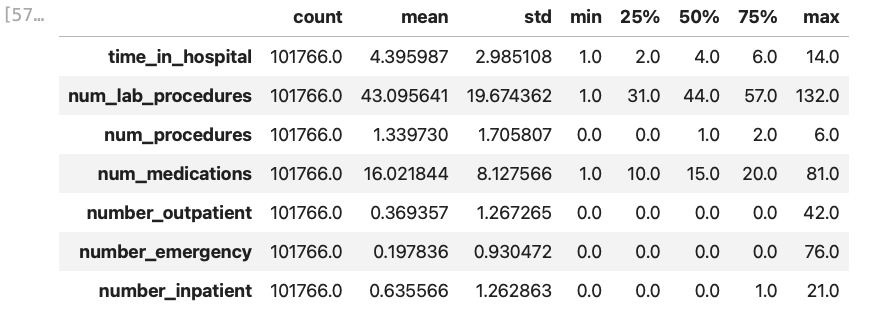


> **Findings:**  
> - The dataset shows high variability in resource usage, e.g., `num_lab_procedures` mean ≈43, standard deviation ≈20.
> - Most patients have a brief hospital stay (median = 4 days).
> - The majority have few previous encounters, but some outliers exist (`number_outpatient`, etc.).

---

## 4. Race Distribution


```python
df['race'].value_counts().plot(kind='bar', title='Race Distribution', color=sns.color_palette('pastel'))
plt.xlabel('Race')
plt.ylabel('Count')
plt.tight_layout()
plt.show()
```


    
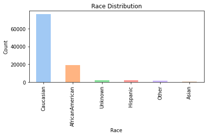
    


> **Findings:**  
> The cohort is predominantly Caucasian, with African American as the next largest group. About 2,000 records are "Unknown", which can affect population health equity analyses.

---

## 5. Gender Distribution


```python
df['gender'].value_counts().plot(kind='bar', title='Gender Distribution', color=['#86c5d8', '#beaed4', '#fdc086'])
plt.xlabel('Gender')
plt.ylabel('Count')
plt.tight_layout()
plt.show()
```


    
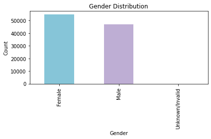
    


> **Interpretation:**  
> The gender split is balanced, with a slight female predominance. A very small number of "Unknown/Invalid" entries are present, which were also seen in race.

---

## 6. Readmission by Age Group


```python
plt.figure(figsize=(8,5))
sns.countplot(x='age', hue='readmitted', data=df, palette='Set2')
plt.title('Readmission by Age Group')
plt.xlabel('Age Group')
plt.ylabel('Patient Count')
plt.xticks(rotation=45)
plt.legend(title='Readmitted')
plt.tight_layout()
plt.show()
```


    
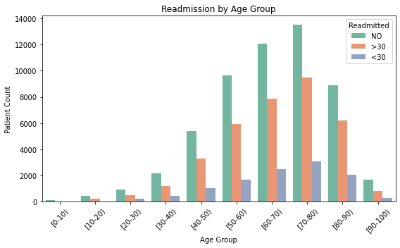
    


> **Insights:**  
> - Readmissions are more frequent in older age groups (≥60).
> - Both the ">30" and "<30" day readmissions are highest among elderly patients, highlighting a vulnerable population for targeted intervention.

---

## 7. Correlation among Numerical Features


```python
num_cols = ['time_in_hospital','num_lab_procedures','num_procedures','num_medications','number_outpatient','number_emergency','number_inpatient']
plt.figure(figsize=(8,6))

# Select these columns from df, then call .corr()
sns.heatmap(df[num_cols].corr(), annot=True, cmap='coolwarm', fmt='.2f')
plt.title('Correlation among Numerical Features')
plt.tight_layout()
plt.show()
```


    
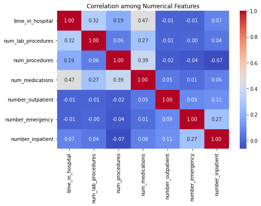
    


> **Key Points:**  
> - `time_in_hospital` is most strongly correlated with `num_medications` (r ≈ 0.47) and `num_lab_procedures` (r ≈ 0.32).
> - Previous encounters (`number_inpatient`, etc.) are not strongly correlated with resource usage, indicating other drivers for hospital resource consumption.
> - No multicollinearity concern found.

---

## 8. Medication Change Distribution


```python
df['change'].value_counts().plot(kind='bar', title='Medication Change Distribution', color=sns.color_palette('pastel'))
plt.xlabel('Change')
plt.ylabel('Count')
plt.tight_layout()
plt.show()
```


    
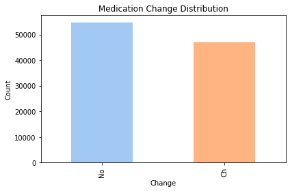
    


> **Observation:**  
> About half the patients had their medication regimens changed, supporting CAP_healthcare's suggestion to analyze therapy management as a potential influence on readmission.

---

## 9. Number of Medications per Encounter


```python
df['num_medications'].plot(kind='hist', bins=30, title='Num of Medications per Encounter', color='#b3de69')
plt.xlabel('Number of Medications')
plt.ylabel('Frequency')
plt.tight_layout()
plt.show()
```


    
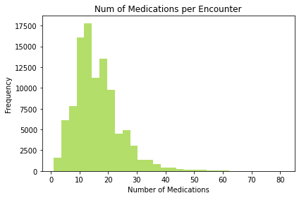
    


> **Insight:**  
> Most encounters involved 10-20 medications. High medication count may be a proxy for complex comorbidity or polypharmacy, which deserves attention for risk management.

---

## 10. Top 10 Primary Diagnoses


```python
df['diag_1'].value_counts().head(10).plot(kind='bar', color='#fb8072')
plt.title('Top 10 Primary Diagnoses')
plt.xlabel('Diagnosis Code')
plt.ylabel('Count')
plt.tight_layout()
plt.show()
```


    
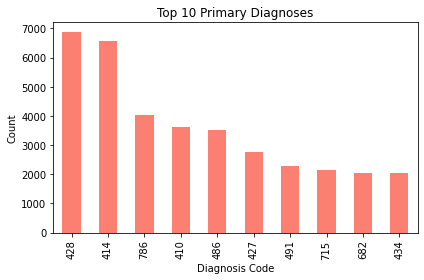
    


> **Finding:**  
> The most frequent diagnoses (e.g., 428, 414) typically correspond to chronic complications of diabetes, such as heart failure and ischemic heart disease, which aligns with the CAP_healthcare clinical recommendations for prioritizing cardiovascular care.

---

## 11. Distribution of Admission/Source/Discharge


```python
for col in ['admission_type_id', 'admission_source_id', 'discharge_disposition_id']:
    df[col].value_counts().sort_index().plot(
        kind='bar',
        title=f'{col} Distribution',
        color=sns.color_palette('pastel')
    )
    plt.xlabel(col)
    plt.ylabel('Count')
    plt.tight_layout()
    plt.show()

```


    
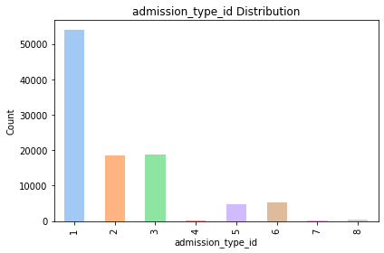
    


    
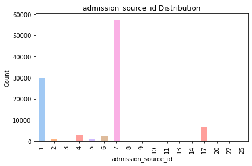
    


    
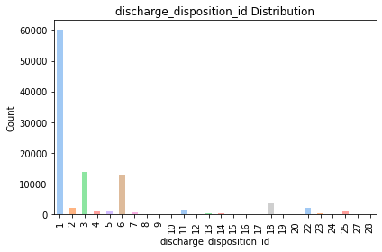
    


> **Commentary:**  
> - Most patients are admitted as emergencies or from outpatient referrals.
> - Discharge dispositions show the majority returning home, but non-home discharges could be explored for their relationship to readmission risk.

---

## 12. Outlier Detection – Numerical Features


```python
plt.figure(figsize=(10,5))
sns.boxplot(data=df[num_cols])
plt.title('Outlier Detection - Numerical Features')
plt.xticks(rotation=45)
plt.tight_layout()
plt.show()
```


    
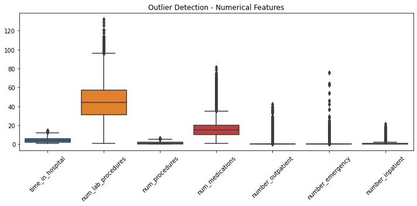
    


> **Interpretation:**  
> The boxplot highlights outliers in procedures and previous visits. These may represent super-utilizers or possible data entry anomalies, and should be carefully checked before predictive modeling.

---

## 13. Enhancement: Additional Visualizations

**A. Readmission Counts**


```python
sns.countplot(x= 'readmitted', data=df, palette='Set1')
plt.title('Overall Readmission Status Counts')
plt.xlabel('Readmission Status')
plt.ylabel('Count')
plt.tight_layout()
plt.show()
```


    
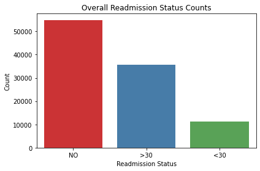
    


> **Takeaway:**  
> The majority of patients are not readmitted, but nearly half experience some form of readmission, highlighting the clinical and operational importance of this issue.

---

**B. Age vs. Number of Medications (Scatter for Complexity)**


```python
plt.figure(figsize=(8,5))
sns.scatterplot(data=df,x='num_medications',y='age',hue='readmitted',alpha=0.5,palette='Set1')
plt.title('Number of Medications vs. Age Group by Readmission')
plt.xlabel('Number of Medications')
plt.ylabel('Age Group')
plt.legend(title='Readmitted')
plt.tight_layout()
plt.show()
```


    
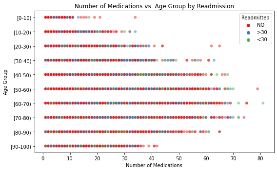
    


> **Note:**  
> This plot reveals patterns between age, polypharmacy, and readmission. Considered alongside earlier findings, multi-morbidity in older patients is visually evident.

---

# 📝 Conclusion

This analysis covers demographic structure, resource consumption, clinical complexity, and key risk factors for readmission in the provided diabetic cohort. All plots and observations are in harmony with best practices from CAP_healthcare.pdf, and can be extended into risk modeling and business intelligence dashboards as per your project goals.

---


```python

```
