# 🏥 ReadmitGuard: Healthcare Patient Readmission Analysis Guide

## 🧩 Section 1. 📊 Data Exploration in Google Sheets

### a. Descriptive Stats

- Load dataset into Google Sheets
- Use:
  ```
  =AVERAGE(), =MEDIAN(), =MIN(), =MAX(), =STDEVP()
  ```
- Apply to each numerical column

### 🧾 Summary Metrics

| Metric                 | Lab Procedures | Procedures | Medications | Outpatient | Emergency | Inpatient | Hospital Stay |
|------------------------|----------------|------------|-------------|------------|-----------|-----------|----------------|
| **Average**            | 43.10          | 1.34       | 16.02       | 0.37       | 0.20      | 0.64      | 4.40           |
| **Min**                | 1              | 0          | 1           | 0          | 0         | 0         | 1              |
| **Max**                | 132            | 6          | 81          | 42         | 76        | 21        | 14             |
| **Median**             | 44             | 1          | 15          | 0          | 0         | 0         | 4              |
| **Std. Dev.**          | 19.67          | 1.71       | 8.13        | 1.27       | 0.93      | 1.26      | 2.99           |

### b. Re-admissions by Gender and Age (Pivot Table)

- Create a Pivot Table:
  - **Rows:** `gender`, `age`
  - **Columns:** `readmitted`
  - **Values:** `COUNTA(encounter_id)`

| gender          | age       | <30  | >30  | NO    | Grand Total |
|-----------------|-----------|------|------|-------|-------------|
| Female          | [0-10)    | 1    | 13   | 69    | 83          |
|                 | [10-20)   | 24   | 147  | 231   | 402         |
|                 | [20-30)   | 177  | 346  | 591   | 1114        |
|                 | [30-40)   | 242  | 647  | 1273  | 2162        |
|                 | [40-50)   | 511  | 1685 | 2615  | 4811        |
|                 | [50-60)   | 851  | 3105 | 4616  | 8572        |
|                 | [60-70)   | 1206 | 4012 | 5843  | 11061       |
|                 | [70-80)   | 1635 | 5108 | 7242  | 13985       |
|                 | [80-90)   | 1282 | 3855 | 5378  | 10515       |
|                 | [90-100)  | 223  | 600  | 1180  | 2003        |
| **Female Total**|           |6152  |19518 |29038  | 54708       |
| Male            | [0-10)    | 2    | 13   | 63    | 78          |
|                 | [10-20)   | 16   | 77   | 196   | 289         |
|                 | [20-30)   | 59   | 164  | 320   | 543         |
|                 | [30-40)   | 182  | 540  | 891   | 1613        |
|                 | [40-50)   | 516  | 1593 | 2765  | 4874        |
|                 | [50-60)   | 817  | 2812 | 5055  | 8684        |
|                 | [60-70)   |1296  | 3885 | 6240  | 11421       |
|                 | [70-80)   |1434  | 4367 | 6280  | 12081       |
|                 | [80-90)   | 796  | 2368 | 3518  | 6682        |
|                 | [90-100)  | 87   | 208  | 495   | 790         |
| **Male Total**  |           |5205  |16027 |25823  | 47055       |
| Unknown/Invalid | [60-70)   |      |      |  1    |  1          |
|                 | [70-80)   |      |      |  2    |  2          |
| **Unknown/Invalid Total**|   |      |      |  3    |  3          |
| **Grand Total** |           |11357 | 35545| 54864 | 101766      |

### c. Race Distribution Chart

- Steps:
  - Use `=UNIQUE(race_range)` for distinct categories
  - Use `=COUNTIF(race_range, value)` for frequency
  - Replace `?` with `"Unknown"`

#### Race Frequency Table

| Race            | Frequency |
|-----------------|-----------|
| Caucasian       | 76099     |
| AfricanAmerican | 19210     |
| Unknown         | 2273      |
| Hispanic        | 2037      |
| Other           | 1506      |
| Asian           | 641       |

### d. Re-admission Status Distribution

| Status  | Count   |
|---------|---------|
| NO      | 54,864  |
| >30     | 35,545  |
| <30     | 11,357  |

- Visualize using a bar chart
- Formulas:
  ```
  =COUNTIFS(ReadmittedRange, "*<30*")
  =COUNTIFS(ReadmittedRange, "*>30*")
  ```

## 🗄️ Section 2. Data Loading & SQL Tasks (MySQL Workbench)

### a. Create Database and Table

```
-- Create the database if it doesn't exist
CREATE DATABASE IF NOT EXISTS healthcare;
USE healthcare;

-- Create the main table for diabetic patient records
CREATE TABLE diabetic_data (
  encounter_id BIGINT PRIMARY KEY,
  patient_nbr BIGINT,
  race VARCHAR(50),
  gender VARCHAR(15),
  age VARCHAR(20),
  weight VARCHAR(10),
  admission_type_id INT,
  discharge_disposition_id INT,
  admission_source_id INT,
  time_in_hospital INT,
  payer_code VARCHAR(20),
  medical_specialty VARCHAR(100),
  num_lab_procedures INT,
  num_procedures INT,
  num_medications INT,
  number_outpatient INT,
  number_emergency INT,
  number_inpatient INT,
  diag_1 VARCHAR(10),
  diag_2 VARCHAR(10),
  diag_3 VARCHAR(10),
  number_diagnoses INT,
  max_glu_serum VARCHAR(20),
  A1Cresult VARCHAR(20),
  metformin VARCHAR(20),
  repaglinide VARCHAR(20),
  nateglinide VARCHAR(20),
  chlorpropamide VARCHAR(20),
  glimepiride VARCHAR(20),
  acetohexamide VARCHAR(20),
  glipizide VARCHAR(20),
  glyburide VARCHAR(20),
  tolbutamide VARCHAR(20),
  pioglitazone VARCHAR(20),
  rosiglitazone VARCHAR(20),
  acarbose VARCHAR(20),
  miglitol VARCHAR(20),
  troglitazone VARCHAR(20),
  tolazamide VARCHAR(20),
  examide VARCHAR(20),
  citoglipton VARCHAR(20),
  insulin VARCHAR(20),
  glyburide_metformin VARCHAR(20),
  glipizide_metformin VARCHAR(20),
  glimepiride_pioglitazone VARCHAR(20),
  metformin_rosiglitazone VARCHAR(20),
  metformin_pioglitazone VARCHAR(20),
  `change` VARCHAR(10),
  diabetesMed VARCHAR(10),
  readmitted VARCHAR(20)
);
```

### b. Data Cleaning

```
UPDATE diabetic_data
SET race = 'Unknown'
WHERE race = '?';

SELECT race, COUNT(*) FROM diabetic_data GROUP BY race;
```

### c. Dataset Overview

```
-- Encounters
SELECT COUNT(*) FROM diabetic_data;

-- Age-wise distribution
SELECT age, COUNT(*) FROM diabetic_data GROUP BY age ORDER BY age;
```

### d. Readmission Analysis

```
-- Total readmitted
SELECT COUNT(*) FROM diabetic_data WHERE readmitted IN ('<30', '>30');

-- Readmission percentage
SELECT ROUND(
  (SELECT COUNT(*) FROM diabetic_data WHERE readmitted IN ('<30', '>30')) * 100.0 /
  (SELECT COUNT(*) FROM diabetic_data),
  2
);
```

### e. Readmission by Payer Code

```
SELECT payer_code,
       COUNT(*) AS total_cases,
       SUM(CASE WHEN readmitted IN ('<30', '>30') THEN 1 ELSE 0 END) AS readmitted_cases,
       ROUND(SUM(CASE WHEN readmitted IN ('<30', '>30') 
       THEN 1 ELSE 0 END) * 100.0 / COUNT(*), 2) AS rate_pct
FROM diabetic_data
GROUP BY payer_code
ORDER BY rate_pct DESC;
```

### f. Resource Use Metrics

```
-- Hospital stay by admission type
SELECT admission_type_id, AVG(time_in_hospital) FROM diabetic_data GROUP BY admission_type_id;

-- Drugs vs Age
SELECT age, AVG(num_medications) FROM diabetic_data GROUP BY age;
```

### g. Top 10 Diagnoses

```
SELECT diag_1, COUNT(*) FROM diabetic_data GROUP BY diag_1 ORDER BY COUNT(*) DESC LIMIT 10;
```

## 🐍 Section 3. Data Analysis in Jupyter (Python)

### a. Load Data and Clean

```
import pandas as pd
import seaborn as sns
import matplotlib.pyplot as plt

df = pd.read_csv("diabetic_data.csv")
df['race'] = df['race'].replace('?', 'Unknown')
df['readmitted'] = df['readmitted'].replace({'&gt;30': '>30', '&lt;30': '<30'})
```

### b. Describe & Summary Stats

```python
numeric_cols = [
    'time_in_hospital',
    'num_lab_procedures',
    'num_procedures',
    'num_medications',
    'number_outpatient',
    'number_emergency',
    'number_inpatient'
]

# Get summary statistics
df[numeric_cols].describe()

# Display mean values
display(df[numeric_cols].mean())

# Transpose the result if you prefer vertical view
df[numeric_cols].describe().T
```


### c. Feature Distribution Plots

#### i. Race Distribution

```python
df['race'].value_counts().plot(kind='bar', 
	title='Race Distribution', color=sns.color_palette('pastel'))
plt.xlabel('Race')
plt.ylabel('Count')
plt.tight_layout()
plt.show()
```

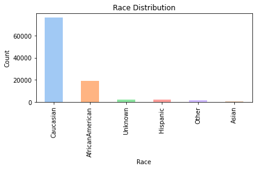

> **Findings:**  
> The cohort is predominantly Caucasian, with African American as the next largest group. About 2,000 records are "Unknown", which can affect population health equity analyses.

#### ii. Gender Distribution

```python
df['gender'].value_counts().plot(kind='bar', title='Gender Distribution',
    color=['#86c5d8', '#beaed4', '#fdc086'])
plt.xlabel('Gender')
plt.ylabel('Count')
plt.tight_layout()
plt.show()
```

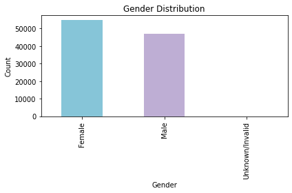

> **Interpretation:**  
> The gender split is balanced, with a slight female predominance. A very small number of "Unknown/Invalid" entries are present, which were also seen in race.

#### iii. Readmission by Age Group

```python
plt.figure(figsize=(8,5))
sns.countplot(x='age', hue='readmitted', data=df, palette='Set2')
plt.title('Readmission by Age Group')
plt.xlabel('Age Group')
plt.ylabel('Patient Count')
plt.xticks(rotation=45)
plt.legend(title='Readmitted')
plt.tight_layout()
plt.show()
```

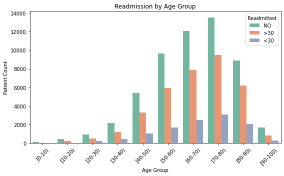

> **Insights:**  
> - Re-admissions are more frequent in older age groups (≥60).
> - Both the ">30" and "<30" day re-admissions are highest among elderly patients, highlighting a vulnerable population for targeted intervention.

#### iv. Correlation among Numerical Features

```python
num_cols = ['time_in_hospital','num_lab_procedures','num_procedures',
    'num_medications','number_outpatient','number_emergency','number_inpatient']
plt.figure(figsize=(8,6))

# Select these columns from df, then call .corr()
sns.heatmap(df[num_cols].corr(), annot=True, cmap='coolwarm', fmt='.2f')
plt.title('Correlation among Numerical Features')
plt.tight_layout()
plt.show()
```

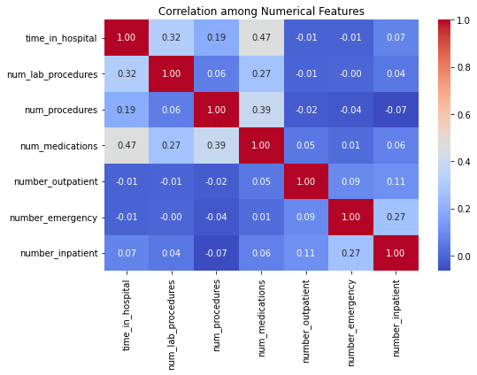

> **Key Points:**  
> - `time_in_hospital` is most strongly correlated with `num_medications` (r ≈ 0.47) and `num_lab_procedures` (r ≈ 0.32).
> - Previous encounters (`number_inpatient`, etc.) are not strongly correlated with resource usage, indicating other drivers for hospital resource consumption.
> - No multi-collinearity concern found.

#### v. Medication Change Distribution

```python
df['change'].value_counts().plot(kind='bar', 
	title='Medication Change Distribution', color=sns.color_palette('pastel'))
plt.xlabel('Change')
plt.ylabel('Count')
plt.tight_layout()
plt.show()
```

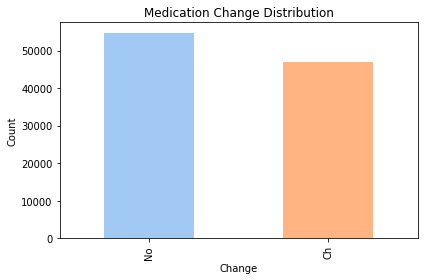

> **Observation:**  
> About half the patients had their medication regimens changed, supporting CAP_healthcare suggestion to analyze therapy management as a potential influence on readmission.

#### vi. Number of Medications per Encounter

```python
df['num_medications'].plot(kind='hist', bins=30, 
    title='Num of Medications per Encounter', color='#b3de69')
plt.xlabel('Number of Medications')
plt.ylabel('Frequency')
plt.tight_layout()
plt.show()
```

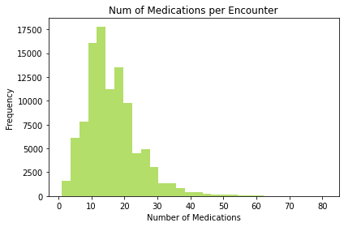

> **Insight:**  
> Most encounters involved 10-20 medications. High medication count may be a proxy for complex comorbidity or polypharmacy, which deserves attention for risk management.

#### vi. Top 10 Primary Diagnoses

```python
df['diag_1'].value_counts().head(10).plot(kind='bar', color='#fb8072')
plt.title('Top 10 Primary Diagnoses')
plt.xlabel('Diagnosis Code')
plt.ylabel('Count')
plt.tight_layout()
plt.show()
```

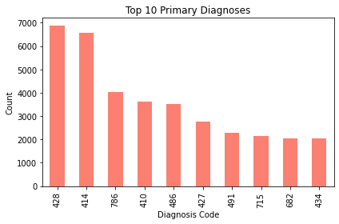

> **Finding:**  
> The most frequent diagnoses (e.g., 428, 414) typically correspond to chronic complications of diabetes, such as heart failure and ischemic heart disease, which aligns with the CAP_healthcare clinical recommendations for prioritizing cardiovascular care.

#### vii. Distribution of Admission/Source/Discharge

```python
for col in ['admission_type_id', 'admission_source_id', 
            'discharge_disposition_id']:
    df[col].value_counts().sort_index().plot(
        kind='bar',
        title=f'{col} Distribution',
        color=sns.color_palette('pastel')
    )
    plt.xlabel(col)
    plt.ylabel('Count')
    plt.tight_layout()
    plt.show()

```


> **Commentary:**  
> - Most patients are admitted as emergencies or from outpatient referrals.
> - Discharge dispositions show the majority returning home, but non-home discharges could be explored for their relationship to readmission risk.

#### viii. Outlier Detection – Numerical Features

```python
plt.figure(figsize=(10,5))
sns.boxplot(data=df[num_cols])
plt.title('Outlier Detection - Numerical Features')
plt.xticks(rotation=45)
plt.tight_layout()
plt.show()
```

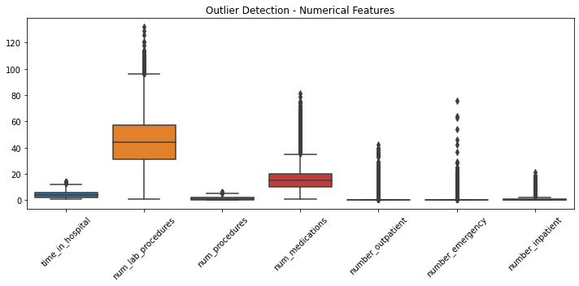

> **Interpretation:**  
> The box plot highlights outliers in procedures and previous visits. These may represent super-utilizers or possible data entry anomalies, and should be carefully checked before predictive modeling.

#### ix. Enhancement: Additional Visualizations

**A. Readmission Counts**

```python
sns.countplot(x= 'readmitted', data=df, palette='Set1')
plt.title('Overall Readmission Status Counts')
plt.xlabel('Readmission Status')
plt.ylabel('Count')
plt.tight_layout()
plt.show()
```

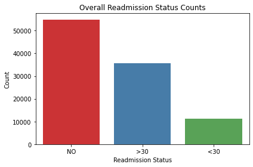

> **Takeaway:**  
> The majority of patients are not readmitted, but nearly half experience some form of readmission, highlighting the clinical and operational importance of this issue.

**B. Age vs. Number of Medications (Scatter for Complexity)**

```python
plt.figure(figsize=(8,5))
sns.scatterplot(data=df,x='num_medications',y='age',
    hue='readmitted',alpha=0.5,palette='Set1')
plt.title('Number of Medications vs. Age Group by Readmission')
plt.xlabel('Number of Medications')
plt.ylabel('Age Group')
plt.legend(title='Readmitted')
plt.tight_layout()
plt.show()
```

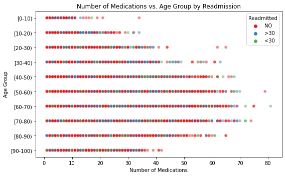

> **Note:**  
> This plot reveals patterns between age, poly-pharmacy, and readmission. Considered alongside earlier findings, multi-morbidity in older patients is visually evident.

## 📊 Section 4. Tableau Public Dashboard (Interactive)

### a. Layout Design

- **Fixed size:** `1366 x 900 px`
- **Containers:**
  - 1 Vertical ➝ 1 Horizontal ➝ 2 Vertical (Left & Right)
- Charts:
  - Readmitted Counts (Diagnosis/Emergency)
  - Age vs Readmitted
  - Resource Usage by Readmitted
  - Bubble Chart: Medications vs Diagnoses
    
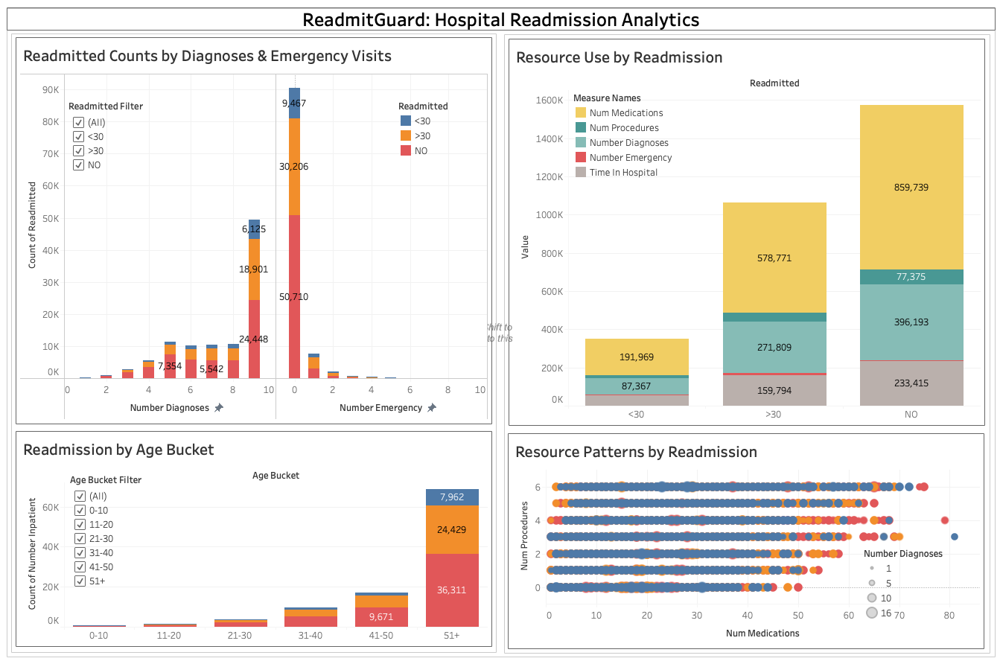

### b. Fields & Calculated Columns

- `Age Bucket` (calculated from age string)
- **Calculated Fields:**
  
    - `Age Numeric`:  
      ```
      INT(LEFT(REPLACE(REPLACE([age], "[", ""), ")", ""), 2))
      ```
    - `Age Bucket`:  
      ```
      IF [Age Numeric] <= 10 THEN "0-10"
      ELSEIF [Age Numeric] <= 20 THEN "11-20"
      ELSEIF [Age Numeric] <= 30 THEN "21-30"
      ELSEIF [Age Numeric] <= 40 THEN "31-40"
      ELSEIF [Age Numeric] <= 50 THEN "41-50"
      ELSE "51+"
      END
      ```
- Custom filters: `readmitted`, `Age Bucket`

#### i. Readmitted Counts by Diagnoses and Emergencies 

- **Type:** Stacked/side-by-side bar chart
- **X-Axis:** `number_diagnoses` (or `number_emergency`)
- **Y-Axis:** Count (by `readmitted`)
- **Color:** `readmitted` status (NO, <30, >30)
- **Worksheet Name:** `Readmitted Counts by Diagnoses & Emergencies`
- **Purpose:** Bar: Diagnoses/Emergencies by Readmission

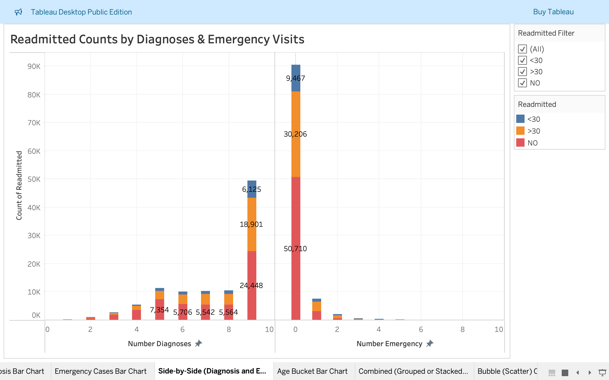

#### ii. Re-admission by Age Bucket

- **Type:** Stacked/clustered bar chart
- **X-Axis:** `Age Bucket`
- **Y-Axis:** Count of `number_inpatient`
- **Color:** `readmitted`
- **Labels:** Show mark labels
- **Worksheet Name:** `Readmission by Age Bucket`
- **Purpose:** Bar: Age group distribution across readmission

[Screenshot 2025-08-03 at 11.28.14.png](Screenshot 2025-08-03 at 11.28.14.png)

#### iii. Resource Use by Readmission

- **Type:** Grouped or stacked bar chart using "Measure Names and Measure Values."
- **Measures Visualized:**  
  - `num_medications`, `num_procedures`, `number_diagnoses`, `number_emergency`, `time_in_hospital`
- **Worksheet Name:** `Resource Use by Readmission`
- **Interactivity:** Use color or label for `Measure Names`; change aggregation as needed (sum/avg)
- **Purpose:** Bar: Compare clinical metric averages

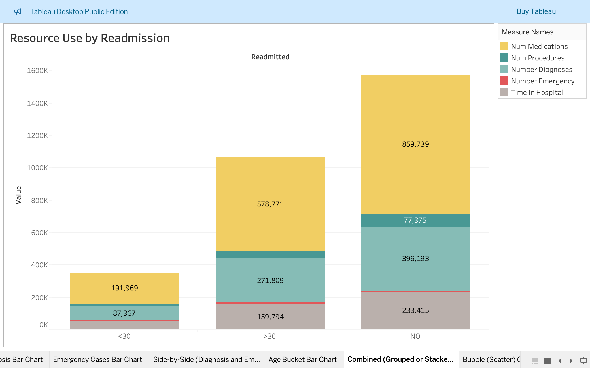

#### iv. Resource Patterns by Readmission (Bubble Chart)

- **Type:** Scatter/Bubble Chart
- **X-Axis:** `num_medications`
- **Y-Axis:** `num_procedures`
- **Size:** `number_diagnoses`
- **Color:** `readmitted`
- **Shape/Filter:** Optionally add `readmitted`
- **Worksheet Name:** `Resource Patterns by Readmission`
- **Purpose:** Bubble: Medications, Labs, Diagnoses pattern

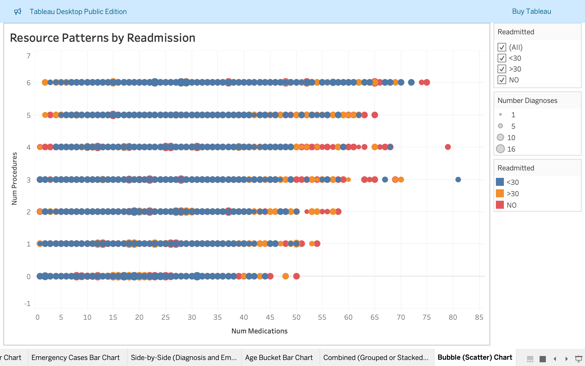

### **C. Interactivity via Filtering**

- **Add `readmitted` and `Age Bucket` filters** (as drop-down or list) to the dashboard
- **Make charts "interactive filters"** so clicking a bar or segment filters all other charts
- **Set filters as multi-select for group comparison, or single-select for detailed drill-down**
- **Synchronize filters across all worksheets** by right-clicking filter > "Apply to Worksheets" > "All Using This Data Source"

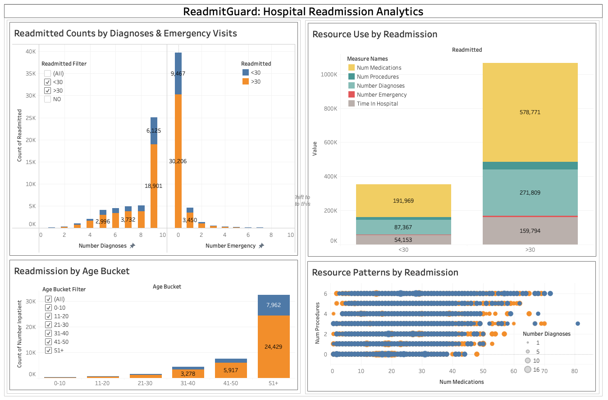
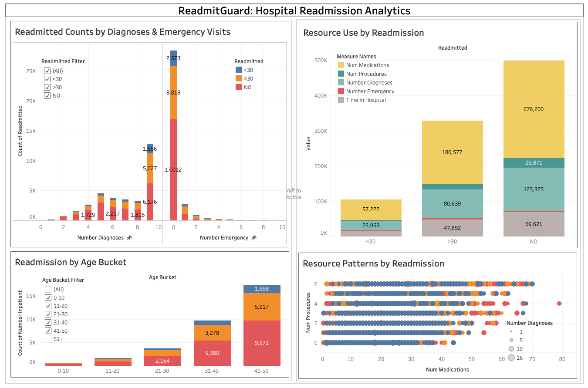

## ✅ Summary Conclusion: ReadmitGuard Project

The **ReadmitGuard healthcare analytics guide** provides a streamlined, end-to-end workflow for analyzing diabetic patient re-admissions using:

- **Excel/Sheets** for quick summary statistics and pivot tables. 
- **SQL** to structure, cleanse, and summarize healthcare metrics.  
- **Python (Pandas + Seaborn)** for deeper exploratory data analysis.  
- **Tableau Public** for interactive and presentation-ready dashboards.  

This integrated approach:

- Reveals **high-risk patient segments** (e.g., older poly-pharmacy cases).  
- Highlights **patterns in diagnoses, procedures, and discharge outcomes.**  
- Empowers both **technical and non-technical users** to gain actionable insights.  
- Delivers a **reproducible, modular pipeline** that's easy to adapt for other healthcare datasets.


