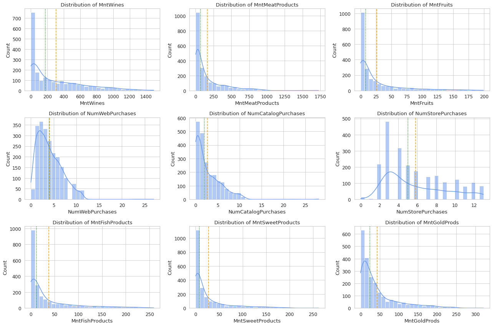

# Retail Marketing Data Analysis: 

## 1. Excel Tasks (Data Exploration)

### Task 1: Create a Statistical Summary for Numerical Features
- Identify and select numerical columns like `Income`, `Year_Birth`, `MntWines`, `Recency`.
- Use Excel's **Quick Analysis → Totals** or **Formulas → More Functions → Statistical** for summary stats: Average, Median, Min, Max, Standard Deviation.
- This gives a numeric overview necessary for understanding customer demographics and spend.
  


  
### Task 2: Line Chart of Number of Enrolments by Year
- Extract the registration year from `Dt_Customer` (handle mixed date formats with Excel formulas).
- Create a pivot or summary table counting customers per enrolment year.
- Plot a line chart showing how customer enrolment varies over time.
  


### Task 3: Cross-tabulation of `Response` and `Education`
- Use Pivot Table to cross-tabulate how campaign response correlates with education levels.
- Helps understand demographic segments more/less responsive.
  


### Task 4: Boxplot for `Income` Analysis
- Create a boxplot for the `Income` variable to visualize distribution and identify outliers.
- This shows income range and spread within your customer base.
  


### Task 5: Calculate `Age` and Create a Histogram
- Derive `Age` from `Year_Birth` or convert dates correctly.
- Use Excel’s histogram chart to visualize the age distribution.
- Useful for identifying predominant age groups.
  


### Task 6: Visualize `Response` vs `Marital_Status` (Bar Chart Suggested)
- Create a bar chart showing counts or percentages of responses by marital status groups.
- Reveals how marital status might influence campaign engagement.

  

## 2. SQL Tasks (Schema Creation + Pre - processing)

### 1. Create Schema and Tables
- Create schema/database: `retail_data`.
- Create a **staging table** with all columns as text (`VARCHAR`) to accept raw CSV import, avoiding errors due to mixed formats or missing values.
- Create final table `marketing_campaign` with typed columns matching CSV headers, including proper numeric types and a `DATE` column for `Dt_Customer`.
- Include `Age` and `Age_Group` columns for demographic analysis.

### 2. Data Import and Conversion
- Import raw CSV data into the staging table.
- Use a SQL `INSERT INTO` statement from staging to final table:
  - Convert income and numeric string fields to numbers, replacing blanks with `NULL`.
  - Parse `Dt_Customer` from mixed formats (e.g. `dd-mm-yyyy` and `mm/dd/yyyy`) using `STR_TO_DATE`.
  - Use provided `Age` or calculate from `Year_Birth`.
  - Assign `Age_Group` categories based on `Age`.

### 3. Key Queries for Data Analysis

#### Total Customer Encounters
```
SELECT COUNT(*) AS total_customers FROM marketing_campaign;
```
 

  
#### Top 10 Purchased Product Categories (Total Spending)
```
SELECT 'MntWines' AS category, SUM(MntWines) AS total_spent FROM marketing_campaign
UNION ALL
SELECT 'MntFruits', SUM(MntFruits) FROM marketing_campaign
UNION ALL
SELECT 'MntMeatProducts', SUM(MntMeatProducts) FROM marketing_campaign
UNION ALL
SELECT 'MntFishProducts', SUM(MntFishProducts) FROM marketing_campaign
UNION ALL
SELECT 'MntSweetProducts', SUM(MntSweetProducts) FROM marketing_campaign
UNION ALL
SELECT 'MntGoldProds', SUM(MntGoldProds) FROM marketing_campaign
ORDER BY total_spent DESC;
```


#### Count of Each Response Value
```
SELECT Response, COUNT(*) AS total_customers
FROM marketing_campaign
GROUP BY Response;
```


#### Education vs Marital Status Distribution
```
SELECT Education, Marital_Status, COUNT(*) AS customer_count
FROM marketing_campaign
GROUP BY Education, Marital_Status
ORDER BY Education, Marital_Status;
```


#### Average Income of Customers Who Responded
```
SELECT AVG(Income) AS avg_income_responders
FROM marketing_campaign
WHERE Response = 1 AND Income IS NOT NULL;
```


#### Total Campaigns Accepted Per Campaign (`AcceptedCmp1` to `AcceptedCmp5`)
```
SELECT
  SUM(AcceptedCmp1) AS Accepted_Cmp1,
  SUM(AcceptedCmp2) AS Accepted_Cmp2,
  SUM(AcceptedCmp3) AS Accepted_Cmp3,
  SUM(AcceptedCmp4) AS Accepted_Cmp4,
  SUM(AcceptedCmp5) AS Accepted_Cmp5
FROM marketing_campaign;
```


#### Distribution of Responses to the Last Campaign
```
SELECT Response, COUNT(*) AS total_customers,
ROUND(COUNT(*) * 100.0 / (SELECT COUNT(*) FROM marketing_campaign), 2) AS pct_of_total
FROM marketing_campaign
GROUP BY Response;
```


#### Average Number of Children (`Kidhome`) and Teenagers (`Teenhome`)
```
SELECT ROUND(AVG(Kidhome), 2) AS avg_kids, ROUND(AVG(Teenhome), 2) AS avg_teens
FROM marketing_campaign;
```


#### Derive `Age_Group` (if not assigned during import)
```
UPDATE marketing_campaign
SET Age_Group = CASE 
    WHEN Age BETWEEN 18 AND 30 THEN '18-30'
    WHEN Age BETWEEN 31 AND 45 THEN '31-45'
    WHEN Age BETWEEN 46 AND 60 THEN '46-60'
    WHEN Age > 60 THEN '60+'
    ELSE 'Unknown' END;
```

#### Average Visits Per Month by `Age_Group`
```
SELECT Age_Group, ROUND(AVG(NumWebVisitsMonth), 2) AS avg_web_visits
FROM marketing_campaign
GROUP BY Age_Group
ORDER BY Age_Group;
```


## 3. Python/Jupyter Tasks: Exploratory Data Analysis (EDA)

### **A. Environment Setup & Directory Structure**
```
import os
# Define directory to store all generated plot images
plot_dir = 'eda_plots'
# Create the directory if it doesn't already exist
if not os.path.exists(plot_dir):
    os.makedirs(plot_dir)
print(f"Plots will save to: {plot_dir}")
```

### **B. Library Import and Data Ingestion**
```
# Standard data analysis libraries
import pandas as pd
import matplotlib.pyplot as plt
import seaborn as sns
from scipy.stats import chi2_contingency
import matplotlib.lines as mlines

# Set global Seaborn plotting style for visual consistency
sns.set(style="whitegrid", palette="muted", font_scale=1.1)

# Load data from CSV into DataFrame
df = pd.read_csv('marketing_campaign.csv')
```

### **C. Data Cleaning and Feature Engineering**
```
# Convert join date column to datetime (handles day-first format)
df['Dt_Customer'] = pd.to_datetime(df['Dt_Customer'], dayfirst=True)

# Merge rare/odd marital status values into 'Other' for clean analysis
df['Marital_Status'] = df['Marital_Status'].replace({'YOLO':'Other', 'Absurd':'Other', 'Alone':'Other'})

# Remove rows with unreasonably high Age (>100 years) or Income (>200,000) as outliers
df = df[df['Age'] <= 100]
df = df[df['Income'] <= 200000]

# Drop columns that have the same value everywhere (no analytical value)
if 'Z_CostContact' in df.columns: df = df.drop(columns=['Z_CostContact'])
if 'Z_Revenue' in df.columns: df = df.drop(columns=['Z_Revenue'])

# Bin Age into categorical groups for demographic profiling
df['Age_Group'] = pd.cut(
    df['Age'],
    bins=,
    labels=['18-30', '31-45', '46-60', '60+']
)
```

### **D. Descriptive Statistics and Feature Diagnostics**
```
# Display key descriptive statistics (mean, std, median, min, max) for numeric columns
display(df.describe().T[['mean', 'std', '50%', 'min', 'max']])

# Visual summary: horizontal boxplot of numeric data (outliers hidden for readability)
plt.figure(figsize=(14,6))
sns.boxplot(data=df.select_dtypes(['number']), orient='h', showfliers=False)
plt.title('Numeric Feature Distributions')
plt.savefig(f'{plot_dir}/Numeric Feature Distributions.png', bbox_inches='tight')
plt.show()
```


### **E. Uni-variate Analysis (Annotated)**
```
# Plot histograms (with KDE) for each selected numeric feature, with central tendency and tail annotated
for col in ['Income', 'MntWines', 'MntFruits', 'MntMeatProducts',
            'MntFishProducts', 'MntSweetProducts', 'MntGoldProds',
            'Recency', 'Kidhome', 'Teenhome', 'Age']:
    plt.figure(figsize=(7,3))
    ax = sns.histplot(df[col].dropna(), kde=True, bins=30, color='cornflowerblue')
    plt.title(f'Distribution of {col}')
    plt.xlabel(col)
    plt.ylabel('Count')
    # Annotate central measures and high-end tail
    plt.axvline(df[col].mean(), color='orange', linestyle='--', label=f"Mean: {df[col].mean():.0f}")
    plt.axvline(df[col].median(), color='green', linestyle=':', label=f"Median: {df[col].median():.0f}")
    q99 = df[col].quantile(0.99)
    if q99 < df[col].max():
        plt.axvline(q99, color='red', linestyle='-.', label=f"99th %ile: {q99:.0f}")
    plt.legend()
    plt.savefig(f'{plot_dir}/Distribution of {col}.png', bbox_inches='tight')
    plt.show()
```




### **F. Combined Multi-panel Categorical Plots**

#### Demographic Counts
```
# Display counts for Education, Marital_Status, Age_Group in three side-by-side barplots
fig, axes = plt.subplots(1, 3, figsize=(18, 5))
for ax, col in zip(axes, ['Education', 'Marital_Status', 'Age_Group']):
    g = sns.countplot(x=col, data=df, ax=ax)
    ax.set_title(f'Count of {col}')
    for c in g.containers:
        g.bar_label(c, fmt='%d')  # Show bar value on top
    ax.set_ylabel('Count')
    ax.tick_params(axis='x', rotation=30)
plt.tight_layout()
plt.savefig(f'{plot_dir}/Demographics_Distribution.png', bbox_inches='tight')
plt.show()
```


#### Campaign Response (Count + Stacked Bars)
```
fig, axes = plt.subplots(1, 3, figsize=(21, 5))

# Campaign response (leftmost panel)
g = sns.countplot(x='Response', data=df, ax=axes, palette='Set2')
axes.set_title('Count of Campaign Response')
for c in g.containers: g.bar_label(c, fmt='%d')

# Stacked Bar: Response by Education (middle panel)
edu_resp = pd.crosstab(df['Education'], df['Response'], normalize='index') * 100
ax2 = edu_resp.plot(kind='bar', stacked=True, colormap='coolwarm', ax=axes)
axes.set_ylabel('Percentage')
axes.set_title('Response Rate (%) by Education')
for container in ax2.containers:
    ax2.bar_label(container, fmt='%.1f', label_type='center')
axes.legend(title='Response')

# Stacked Bar: Response by Marital Status (rightmost panel)
ms_resp = pd.crosstab(df['Marital_Status'], df['Response'], normalize='index') * 100
ax3 = ms_resp.plot(kind='bar', stacked=True, colormap='crest', ax=axes)
axes.set_ylabel('Percentage')
axes.set_title('Response Rate (%) by Marital Status')
for container in ax3.containers:
    ax3.bar_label(container, fmt='%.1f', label_type='center')
axes.legend(title='Response')

plt.tight_layout()
plt.savefig(f'{plot_dir}/Campaign_Response_Distributions.png', bbox_inches='tight')
plt.show()
```


### **G. Numeric Features by Response (Box plots with Median/Mean Lines)**
```
# Compare Income, MntWines, Recency by response group with boxplots,
# overlaying group medians (red dashed) and means (blue dash-dot)
fig, axes = plt.subplots(1, 3, figsize=(18, 5))
for i, col in enumerate(['Income', 'MntWines', 'Recency']):
    ax = sns.boxplot(x='Response', y=col, data=df, showfliers=False, palette='Set1', ax=axes[i])
    ax.set_title(f'{col} by Campaign Response')
    med = df.groupby('Response')[col].median()
    mean = df.groupby('Response')[col].mean()
    # Overlay median and mean lines for each response group
    for j, resp in enumerate(sorted(df['Response'].unique())):
        ax.plot([j-0.2, j+0.2], [med[resp]]*2, color='red', linestyle='--', lw=2, label='Median' if (i==0 and j==0) else "")
        ax.plot([j-0.2, j+0.2], [mean[resp]]*2, color='blue', linestyle='-.', lw=2, label='Mean' if (i==0 and j==0) else "")
    if i == 0: ax.legend()
plt.tight_layout()
plt.savefig(f'{plot_dir}/Numeric_Features_by_Response.png', bbox_inches='tight')
plt.show()
```


### **H. Correlation Heat map**
```
# Correlation heatmap to visualize relationships among all numeric variables
plt.figure(figsize=(18, 14))
corr_matrix = df.select_dtypes(include=['int64', 'float64']).corr()
sns.heatmap(
    corr_matrix,
    annot=True,
    fmt=".2f",
    cmap='coolwarm',
    center=0,
    annot_kws={"size": 8}
)
plt.title('Correlation Heatmap of Numeric Features', fontsize=16)
plt.xticks(rotation=45, ha='right', fontsize=10)
plt.yticks(fontsize=10)
plt.tight_layout()
plt.savefig(f'{plot_dir}/Correlation_Heatmap.png', bbox_inches='tight')
plt.show()
```


### **I. Automated Insights Summary**
```
# Function auto-generates bullet-pointed analysis summary from key EDA findings
def generate_insights(df):
    insights = []
    # Get number of customers (rows) and features (columns)
    n_rows, n_cols = df.shape
    insights.append(f"Dataset contains {n_rows:,} customers and {n_cols} features after cleaning.")

    # Overall response rate
    response_rate = df['Response'].mean() * 100
    insights.append(f"Overall campaign response rate: {response_rate:.2f}%.")

    # Correlation insights
    corr = df.select_dtypes(include=['int64', 'float64']).corr()['Response'].drop('Response').sort_values(ascending=False)
    top_positive = corr.head(3)
    top_negative = corr.tail(3)
    insights.append("Top positive correlations with Response: " +
                    ", ".join([f"{idx} ({val:.2f})" for idx, val in top_positive.items()]))
    insights.append("Top negative correlations with Response: " +
                    ", ".join([f"{idx} ({val:.2f})" for idx, val in top_negative.items()]))

    # Complaint rate
    complaint_rate = df['Complain'].mean() * 100
    insights.append(f"Complaint rate in dataset: {complaint_rate:.2f}% (very low, indicating high satisfaction or underreporting).")

    # Impact of data cleaning
    if df['Age'].max() <= 100 and df['Income'].max() <= 200000:
        insights.append("Outliers for Age (>100) and Income (>200,000) were removed, improving analysis robustness.")

    # Age group stats
    age_counts = df['Age_Group'].value_counts(normalize=True) * 100
    dominant_age_group = age_counts.idxmax()
    smallest_age_group = age_counts.idxmin()
    insights.append(f"Most common age group: {dominant_age_group} ({age_counts.max():.1f}%).")
    insights.append(f"Smallest age group: {smallest_age_group} ({age_counts.min():.1f}%).")

    # Income difference by response group
    income_resp = df.groupby('Response')['Income'].median()
    if 1 in income_resp and 0 in income_resp:
        diff_income = income_resp[1] - income_resp[0]
        insights.append(f"Median income for responders is {diff_income:.0f} higher than for non-responders.")

    # Education and marital status with highest response
    edu_rate = (df.groupby('Education')['Response'].mean() * 100).sort_values(ascending=False)
    top_edu = edu_rate.index[0]
    insights.append(f"Highest response rate by education: {top_edu} ({edu_rate.iloc[0]:.1f}%).")

    ms_rate = (df.groupby('Marital_Status')['Response'].mean() * 100).sort_values(ascending=False)
    top_ms = ms_rate.index[0]
    insights.append(f"Highest response rate by marital status: {top_ms} ({ms_rate.iloc[0]:.1f}%).")

    # Response rate for smallest age group
    rare_category = smallest_age_group
    rare_rate = df[df['Age_Group'] == rare_category]['Response'].mean() * 100
    insights.append(f"Response rate for smallest age group ({rare_category}): {rare_rate:.1f}%.")

    return insights

# Usage:
summary_points = generate_insights(df)
print("\n=== Automated EDA Insights Summary ===\n")
for point in summary_points:
    print("-", point)
```


## 4. Tableau Public Tasks (Interactive Dashboard)

### **A. Getting Started**

- Download and install Tableau Public for macOS.
- Connect to your cleaned data file (CSV or Excel) exported from previous steps.

### **B. Key Visualization Tasks in Tableau Public**

#### **1. Customer Income Distribution by Registration Year (Histogram)**

- Create a new worksheet.
- Drag `Dt_Customer` (or its extracted year) to Columns and set it to "Year".
- Drag `Income` to Columns again, then use **Show Me → Histogram**.
- Y-axis will auto-populate with `Number of Records` (frequency).
- Adjust bin size for Income ([Income (bin)] → "Edit").
- Add `Education` to Color for segment comparison.


#### **2. Education vs Marital Status (Clustered Bar Chart)**

- New worksheet: Drag `Education` to Columns.
- Drag `Marital_Status` to Columns next to Education (for side-by-side bars), or to Color for segmentation.
- Drag `COUNTD(ID)` to Rows.
- Use **Show Me → Side-by-Side Bars**; verify multiple bars per Education.
- Add labels by dragging the measure to Label in the Marks card.


#### **3. Normalized Wine Spending vs Income (Scatter Plot)**

- New worksheet: Drag `Income` to Columns, `MntWines` to Rows.
- For normalization, create two calculated fields:
    - **Normalized Income (Z-Score):**
      ```
      ([Income] - { FIXED : AVG([Income]) }) / { FIXED : STDEV([Income]) }
      ```
    - **Normalized Wine Spend (Z-Score):**
      ```
      ([MntWines] - { FIXED : AVG([MntWines]) }) / { FIXED : STDEV([MntWines]) }
      ```
- Use these fields as axes: `Normalized Income` (X), `Normalized Wine Spend` (Y).
- Add demographic `Response` to Color for more insights.
- Drag `ID` to Detail for tooltips on individual customers.


#### **4. Top N Purchasers Across Spending Categories**

- For each spend category (e.g., Wines, Meats):
    - Create worksheet: Drag `ID` to Rows, measure (e.g., `MntWines`) to Columns.
    - Sort descending by spend amount.
    - Create a parameter (`Top N Parameter`) for N; set Data Type: Integer.
    - In Filter for ID, use the “Top” tab: By Field, set “Top N by SUM(Measure)” and connect to your parameter.
    - Display the parameter control for user interaction.
    - Duplicate worksheet for 'MntMeatProducts' categories as needed.


#### **5. Dashboard Compilation**

- Click Dashboard → New Dashboard.
- Set size: Fixed 1300x1600 px recommended for desktop viewing.
- **Layout suggestion (using vertical containers)**:
    - **Left Column**: (Customer Segments) “Income by Year”, “Education vs Marital Status”
    - **Right Column - Top**: (Spending Analysis) “Normalized Wine Spend vs Normalized Income”
    - **Right Column - Bottom**: (Top N Purchasers) “Top N Wine Purchases” (above), “Top N Meat Purchases” (below)
- Drag each worksheet onto the canvas; arrange and resize for clarity.
- Place filters and Top N parameters at the top/side for user interaction.
- Add section headings using Text objects (e.g., “Customer Segments”, “Spending Analysis”, “Top N Purchasers”).
- Ensure legends and color coding are visible and consistent.
- Test the dashboard layout with “Device Preview” to confirm readability across devices.
- Publish final dashboard to Tableau Public (File → Save to Tableau Public As…).


## 5. Conclusion & Summary

This workflow provides an end-to-end approach for retail marketing data analysis—starting from Excel and SQL-based exploration, moving through robust Python EDA, and culminating in interactive Tableau Public dashboards.

**Excel tasks** gave you quick exploration and visual summaries, helping identify basic trends and outliers.  
**SQL scripts** enabled structured data cleaning, type handling, demographic enrichment, and repeatable business queries.  
**Python and Jupyter** brought deeper, flexible analysis: systematic feature engineering, diagnostic visualizations, statistical summaries, and automated insight generation.

**Tableau Public** extended these insights into a powerful, interactive environment:
- Histograms and demographic bar charts for segment overview
- Scatter plots and normalized metrics for spend correlations and outlier detection
- “Top N” purchasers visualizations surfaced customer value leaders
- Dashboard compilation delivered an at-a-glance, customizable view for stakeholders

Throughout, best practices were applied for data cleaning, visual clarity, and reporting—making your analysis both insightful and accessible.

By following this comprehensive pipeline, you are now equipped to:
- Detect and act on key customer trends
- 
- Understand drivers of campaign response
- Identify high-value customers for targeting
- Share findings in executive-ready, interactive reports

**This unified process lays the foundation for advanced segmentation, predictive modeling, and data-driven marketing strategy. As your data or business needs grow, you can extend every step for ever more powerful insights.**


